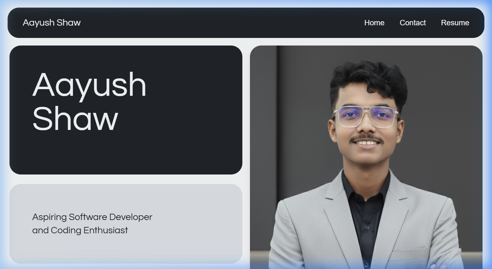

<div align="center">

# aayushshaw.vercel.app

My personal portfolio — a single-page site built with React, TypeScript, and Vite.

[](https://aayushshaw.vercel.app/)
[](https://react.dev)
[](https://www.typescriptlang.org/)
[](https://vitejs.dev)

</div>

---

<p align="center">
  
</p>

---

## Stack

**Core** — React 18 · TypeScript · Vite 5 · Tailwind CSS 3  
**UI** — Radix UI primitives · Lucide icons · CSS custom properties  
**Routing** — React Router v6  
**Contact** — EmailJS (honeypot + rate-limited)  
**SEO** — Open Graph · Twitter Cards · JSON-LD · Sitemap · Canonical URL  
**Deploy** — Vercel (auto-deploy on push)

## Quick Start

```bash
git clone https://github.com/Aayush-secured-exe/portfolio-site-mine.git
cd portfolio-site-mine
npm install
cp .env.example .env   # add your EmailJS keys
npm run dev             # → http://localhost:8888
```

## Environment

| Variable | Description |
|---|---|
| `VITE_EMAILJS_SERVICE_ID` | EmailJS service identifier |
| `VITE_EMAILJS_TEMPLATE_ID` | EmailJS email template ID |
| `VITE_EMAILJS_PUBLIC_KEY` | EmailJS client-side public key |

See [`.env.example`](.env.example) for the template. Get keys from [dashboard.emailjs.com](https://dashboard.emailjs.com/).

## Scripts

```bash
npm run dev       # dev server (port 8888)
npm run build     # production bundle → dist/
npm run preview   # preview production build
npm run lint      # eslint
```

## Project Layout

```
src/
├── components/        # UI sections (Hero, About, Experience, etc.)
│   └── ui/            # Radix-based primitives (toast, tooltip)
├── hooks/             # useScrollAnimation, useToast, useMobile
├── lib/               # Utilities (cn)
├── pages/             # Route pages (Index, NotFound)
├── assets/            # Static images
├── App.tsx            # Root component + providers
├── main.tsx           # Entry point
└── index.css          # Design tokens + Tailwind layers

public/
├── og-image.png       # Social preview (1200×630)
├── sitemap.xml        # Search engine sitemap
└── robots.txt         # Crawler directives
```

## Deploy

Push to `main` → Vercel auto-deploys.

Add `VITE_EMAILJS_*` vars in **Vercel → Project Settings → Environment Variables**.

## License

© 2026 Aayush Shaw
